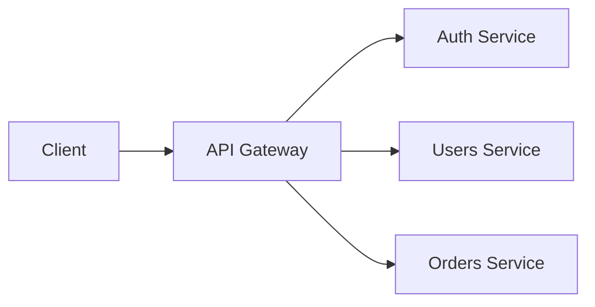

Let's explore API Gateway design patterns.

## Gateway Routing



## Rate Limiting

```typescript
interface RateLimitConfig {
  windowMs: number;
  maxRequests: number;
}

class RateLimiter {
  private requests: Map<string, number[]> = new Map();

  constructor(private config: RateLimitConfig) {}

  isAllowed(clientId: string): boolean {
    const now = Date.now();
    const windowStart = now - this.config.windowMs;
    
    const requests = this.requests.get(clientId) || [];
    const validRequests = requests.filter(time => time > windowStart);
    
    return validRequests.length < this.config.maxRequests;
  }
}
```