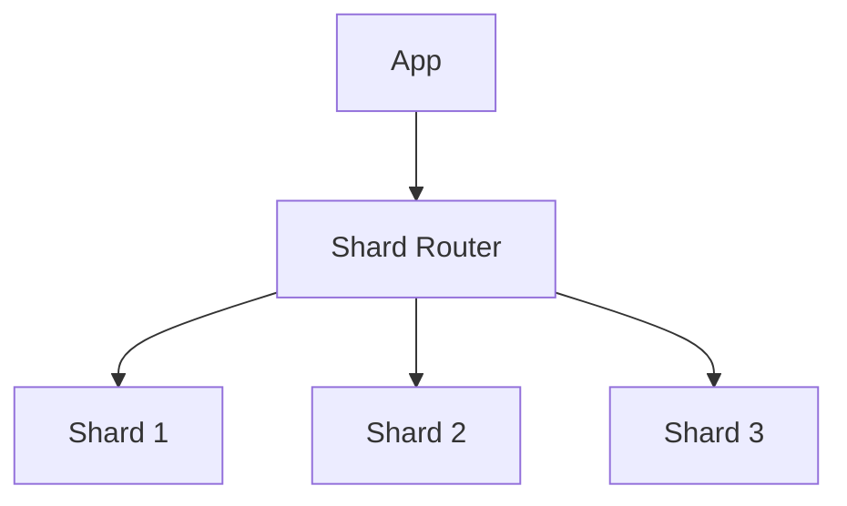

Let's explore database sharding strategies.

## Sharding Architecture



## Shard Key Selection

```typescript
interface ShardConfig {
  shardCount: number;
  strategy: 'hash' | 'range';
}

class ShardRouter {
  constructor(private config: ShardConfig) {}

  getShardId(key: string): number {
    if (this.config.strategy === 'hash') {
      return this.hashStrategy(key);
    }
    return this.rangeStrategy(key);
  }

  private hashStrategy(key: string): number {
    const hash = this.hashFunction(key);
    return hash % this.config.shardCount;
  }
}
``` 