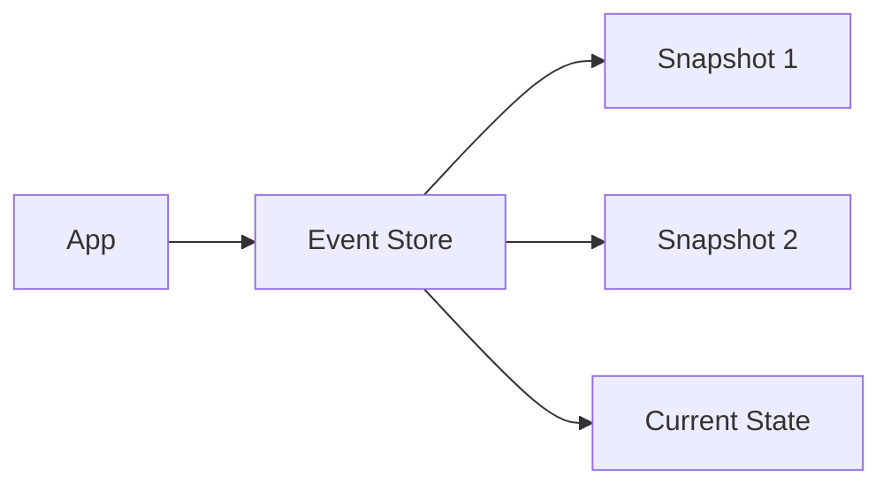

Let's explore event sourcing implementation.

## Event Store



## Event Handler

```typescript
interface Event {
  id: string;
  type: string;
  data: any;
  timestamp: number;
}

class EventStore {
  private events: Event[] = [];

  append(event: Event): void {
    this.events.push(event);
  }

  getEvents(aggregateId: string): Event[] {
    return this.events.filter(e => e.id === aggregateId);
  }
}
``` 