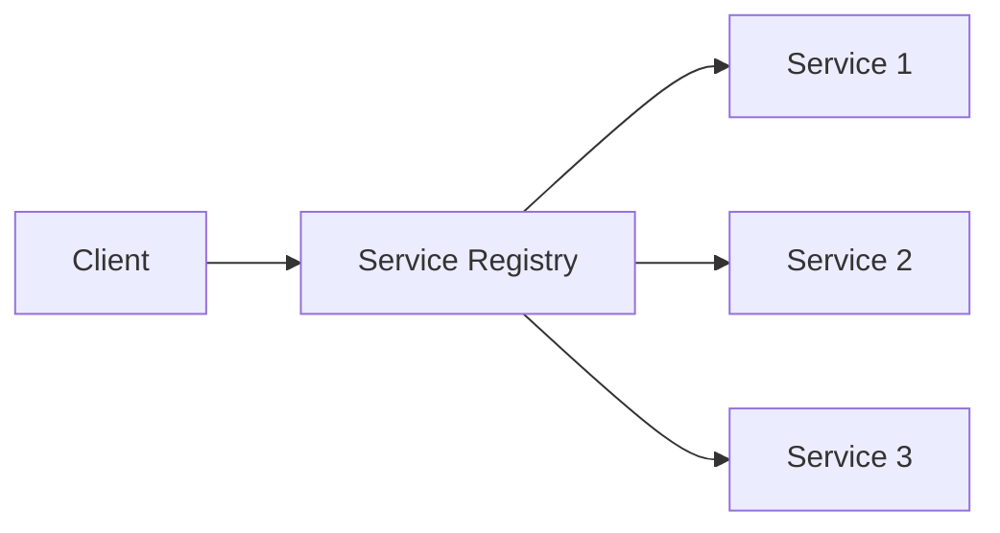

Let's explore microservices architecture patterns.

## Service Discovery



## Circuit Breaker Pattern

```typescript
interface CircuitBreakerConfig {
  failureThreshold: number;
  resetTimeout: number;
}

class CircuitBreaker {
  private failures: number = 0;
  private state: 'CLOSED' | 'OPEN' | 'HALF_OPEN' = 'CLOSED';

  constructor(private config: CircuitBreakerConfig) {}

  async execute(operation: () => Promise<any>) {
    if (this.state === 'OPEN') {
      throw new Error('Circuit breaker is OPEN');
    }
    
    try {
      const result = await operation();
      this.reset();
      return result;
    } catch (error) {
      this.handleFailure();
      throw error;
    }
  }
}
``` 