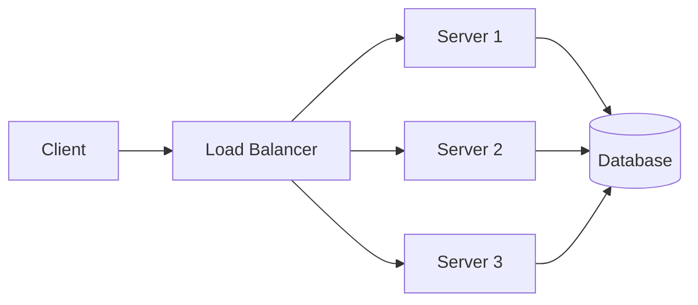

# System Design: Building Scalable Web Applications

Let's explore the key principles and patterns for designing scalable web applications.

## Load Balancing



## Caching Strategies

```typescript
interface CacheConfig {
  strategy: 'write-through' | 'write-back' | 'write-around';
  ttl: number;
  maxSize: number;
}

class CacheManager<T> {
  private cache: Map<string, T>;
  private config: CacheConfig;

  constructor(config: CacheConfig) {
    this.cache = new Map();
    this.config = config;
  }

  async get(key: string): Promise<T | null> {
    if (this.cache.has(key)) {
      return this.cache.get(key)!;
    }
    return null;
  }
}
```